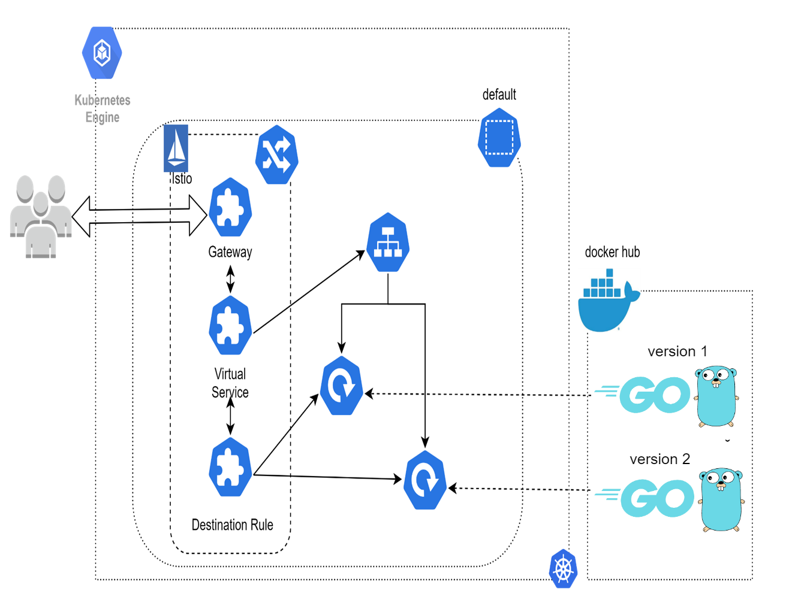

# Canary Control with Go: K8s & Istio Traffic Management

This repository contains the code and resources presented in the "Canary Control with Go: K8s & Istio Traffic Management" talk.

## 📂 Folder Structure

### `canary`
Contains code demonstrating the Go client, API machinery, dynamic client, and controller runtime libraries.

### `demo-k8s-manifests`
Kubernetes manifests for the services deployed using Go.

### `terraform/cluster`
Instructions and configurations to spin up a Kubernetes cluster using Terraform.

### `canaryoperator`
A demonstration of the Canary operator.

## 🛠 Setup and Configuration

### Install kubectl and configure cluster access
Follow the guide provided by Google Cloud on [how to access your cluster using kubectl](https://cloud.google.com/kubernetes-engine/docs/how-to/cluster-access-for-kubectl).

### Install Istio
For Istio setup and installation, refer to the [official Istio getting started guide](https://istio.io/latest/docs/setup/getting-started/).
